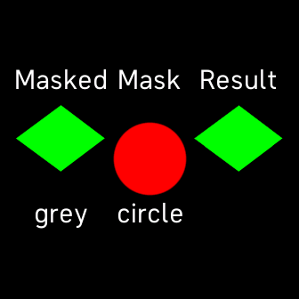
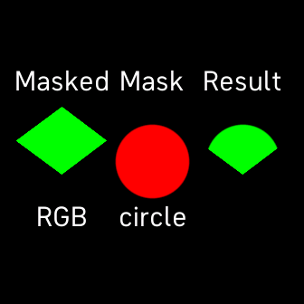

# fitbit-mask-test
Fitbit SVG &lt;mask> test app.

## Usage

Touch left shape to cycle to next masked element.

Toggle centre shape to cycle to next mask element.

Touch top of screen to toggle background (rect below).

Touch bottom of screen to toggle overlay (line on top).

## Bugs Found

*(on Versa 3 hardware)*

1. Greyscale images cannot be masked. Example:

The above image should look like:

This bug precludes masking grayscale magic effects.

2. The mask element is displayed. Example:

.png "mask element displayed")

The black areas in the Result image above should not have been drawn, allowing the blue rect beneath it to show through. (The mask element was filled with black, which is why those areas erronously appear black.)

(Workaround: mask colours or fill must match underlying elements, or black if none).

## Other Conclusions

Images (RGB or greyscale) used as masks must employ transparency. Opaque pixels (including black) are considered to be ‘on’.

It doesn’t make sense to use gradientRect or gradientArc as masks (and their colours will bleed through if used). Just use rect or arc.

## Disclaimer

This code is badly written! I can do better.